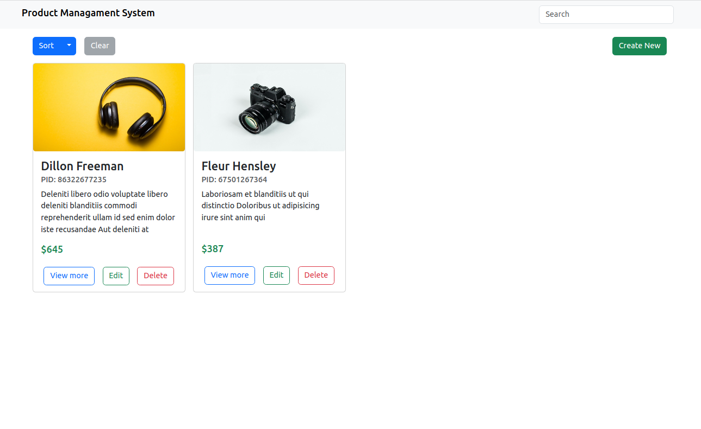
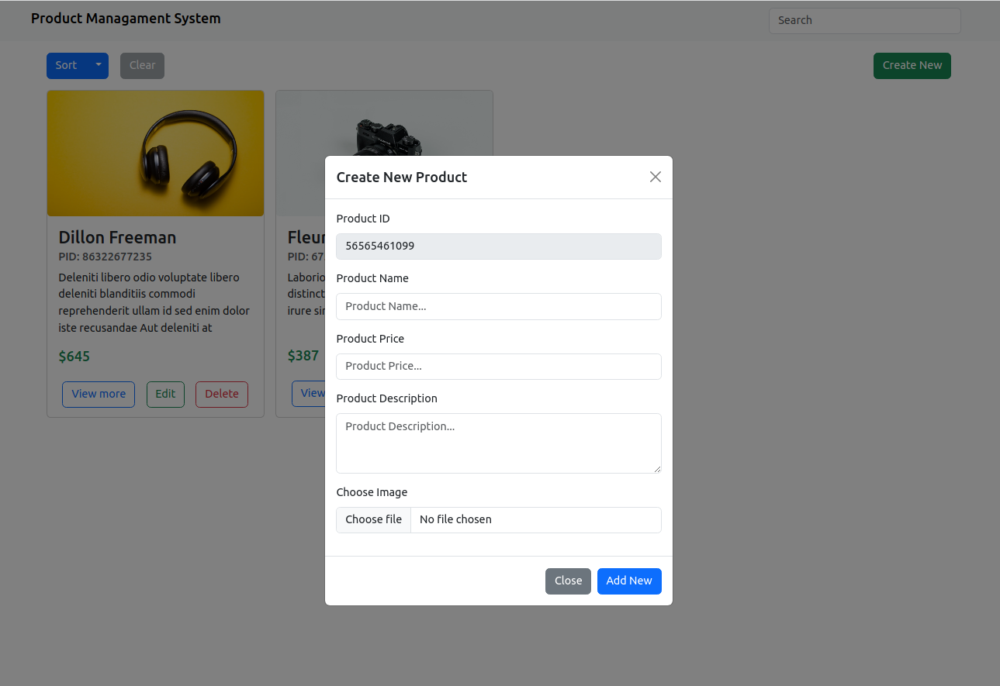
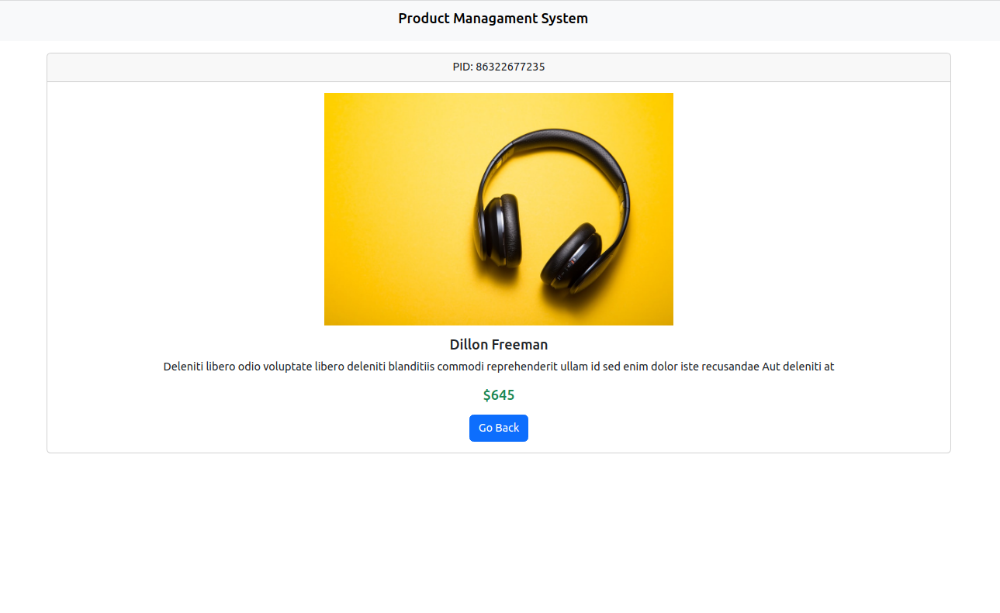
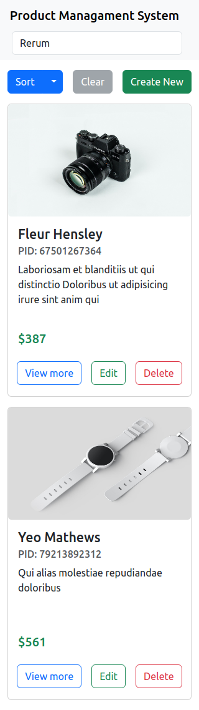

# **Product Management System - CRUD Operations**

This project is a web-based Product Management System that allows users to perform CRUD (Create, Read, Update, Delete) operations on products.

**Deploy Link: [https://pms-practical.netlify.app/](https://pms-practical.netlify.app/)**

## **Technologies Used**

The project is built using the following technologies:

- HTML
- CSS
- JavaScript
- Bootstrap

## **Features**

The following features are implemented in the Product Management System:

- View all products
- Add new product
- Update existing product
- Delete product
- View details of a specific product
- Sort and Filter Options by name,id and price.

## **Getting Started**

To run the project locally, follow these steps:

1. Clone the repository:
    
    ```
    git clone https://github.com/zilenmodi/PMS-Practical.git
    ```
    
2. Open the project folder in your code editor.
3. Open the **`index.html`** file in your web browser.

## **Usage**

The Product Management System has a user-friendly interface that allows users to easily perform CRUD operations on products. The main menu consists of the following options:

- View All Products - Allows the user to view a list of all products.
- Add Product - Allows the user to add a new product to the system.
- Update Product - Allows the user to update an existing product in the system.
- Delete Product - Allows the user to delete a product from the system.
- Search Products - Allows the user to search for a specific product by name.

## **Screenshots**

**Home Page View:**



**Create New Modal:**



**Specific Product:**



**Mobile View:**



## **Credits**

This project was created by Zilen Modi.